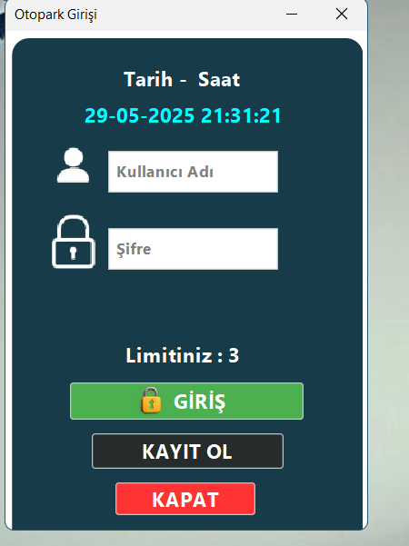
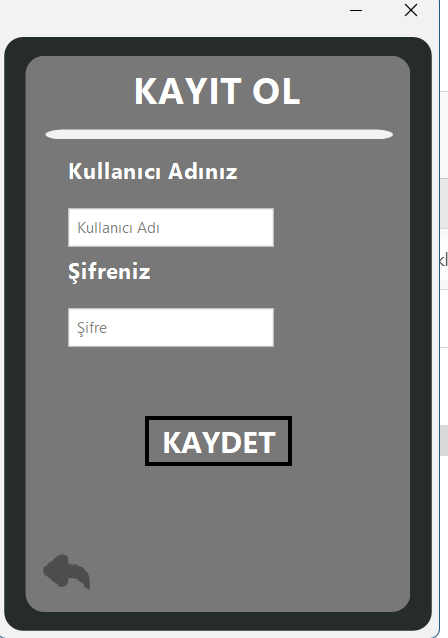
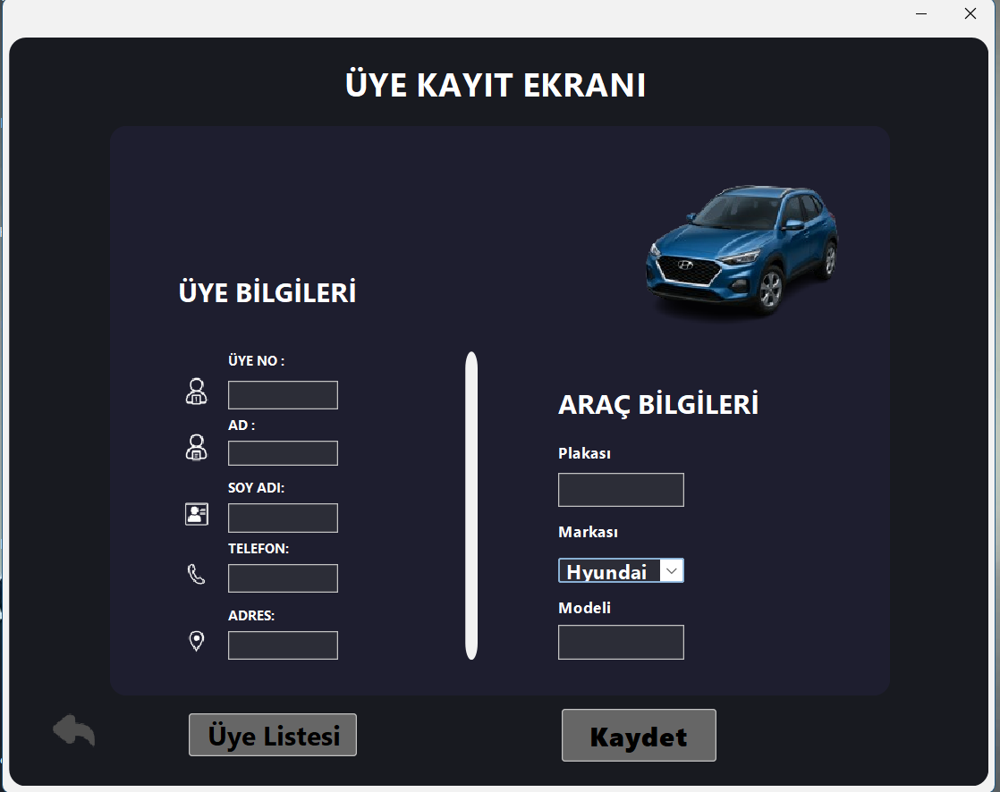
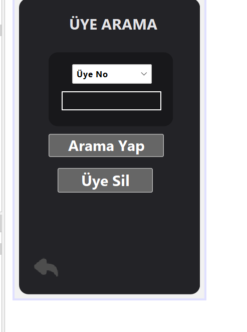
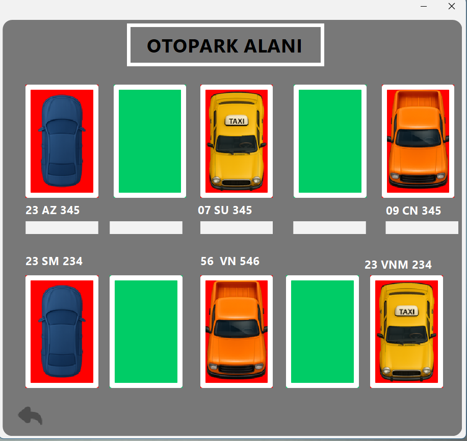
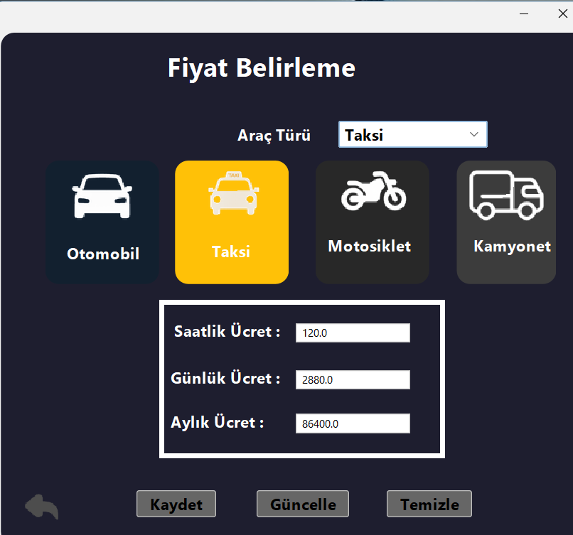

# 🚗 Otopark Otomasyonu Projesi

Java ve Swing kullanılarak geliştirilmiş, kullanıcı dostu ve görsel açıdan zengin **masaüstü otopark yönetim sistemi**.  
Kullanıcı kayıt/giriş, araç kaydı, otopark alanı yönetimi ve fiyat belirleme gibi temel otopark işlevlerini destekler.

---

## 📷 Ekran Görüntüleri

### 🔐 Giriş Ekranı

### 📝 Kayıt Ol Ekranı

### 🧾 Ana Menü (İşlem Seçimi)

### 🧑‍💼 Üye Kayıt Ekranı

### 🔍 Üye Arama Ekranı

### 🅿️ Otopark Alanı Görseli

### 💰 Fiyat Belirleme Paneli

---

## 🔧 Özellikler

- 🔐 **Kullanıcı Giriş/Kayıt**:
  - Güvenli kullanıcı adı ve şifre kontrolü
  - Giriş hakkı sınırı (3 deneme)
  - Anlık saat/tarih gösterimi

- 🧾 **Ana Menü Paneli**:
  - Farklı işlemler arasında hızlı geçiş
  - Temiz, sade ve ikonlu arayüz

- 👤 **Üye Kayıt Modülü**:
  - Kişisel bilgiler + araç bilgileri
  - Veritabanına kayıtlı olarak saklama

- 🔍 **Üye Arama & Silme**:
  - Üye no ile arama
  - Silme ve listeleme desteği

- 🚗 **Otopark Görsel Alanı**:
  - Araçların doluluk durumlarını gösteren grafik alan
  - Farklı araç türleriyle (otomobil, taksi, kamyonet...)

- 💸 **Fiyat Belirleme Paneli**:
  - Araç türüne göre saatlik, günlük, aylık fiyat belirleme
  - Fiyatları güncelleme, kaydetme, temizleme butonları

---

## 💻 Teknolojiler

- Java SE (Swing GUI)
- JDBC (Veritabanı bağlantısı)
- MySQL
- NetBeans IDE
- Git & GitHub

---

## 🚀 Kurulum & Çalıştırma

1. MySQL üzerinde `otopark_otomosyonu` isimli bir veritabanı oluşturun.
2. dist bulunan veri tabanını içe aktarın   .
3. `DBConnection.java` içindeki veritabanı bağlantı bilgilerini güncelleyin.(önce çalışıyor mu diye kontrol edenin sorun olursa portu localhost değiştiebilirsiniz)
4. NetBeans veya başka bir IDE ile `Otopark_Otomasyonu.java` ya da `Kayit_Ol.java` üzerinden çalıştırın.( dist klasöründe bulunan .jar basıp kullanmaya başlaya bilrisiniz eğer koldarı düzenlemek istemiyorsanız )

---

## 📝 Notlar

- **Türkçe karakter desteği** mevcuttur.
- Şifrelerde güvenlik kontrolü uygulanır.
- Kullanıcı adı kurallarına uygunluk zorunludur.
- Görsel arayüzlerde ikonlar ve renkler kullanıcı deneyimini güçlendirmek amacıyla seçilmiştir.

---

## 📄 Lisans

MIT Lisansı

---

## 🙏 Teşekkür

Bu projeyi tamamlarken desteğini esirgemeyen herkese teşekkür ederim.  
Yeni projelerde görüşmek üzere! ✨
